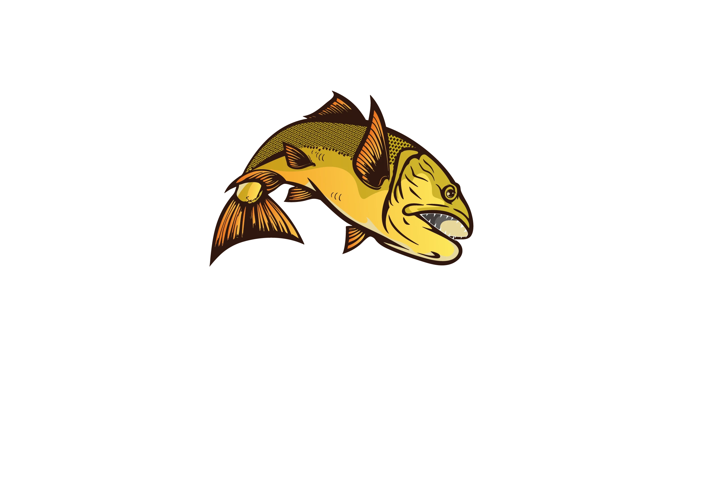

# Eldorado Lake — Pesca Esportiva de Alto Padrão ao Dourado

<div align="center">



Plataforma oficial da maior operação de pesca esportiva ao Dourado no Lago Foz do Areia (Represa Bento Munhoz da Rocha Netto), em Pinhão - Paraná.

[](https://www.eldoradolake.com.br/)
[](https://www.eldoradolake.com.br/)
[](https://www.eldoradolake.com.br/)
[](https://www.eldoradolake.com.br/)
[](https://www.eldoradolake.com.br/)
[](LICENSE)

**Website Oficial:** [https://www.eldoradolake.com.br/](https://www.eldoradolake.com.br/)

</div>

---

## 📋 Sumário

- [Visão Geral](#-visão-geral)
- [Design System & Estética](#-design-system--estética)
- [Estrutura de Páginas](#-estrutura-de-páginas)
- [Engenharia & Otimizações de Performance](#-engenharia--otimizações-de-performance)
- [SEO, Schema.org & Suporte a Agentes de IA](#-seo-schemaorg--suporte-a-agentes-de-ia)
- [Responsividade & Compatibilidade Multidispositivo](#-responsividade--compatibilidade-multidispositivo)
- [Estrutura do Repositório](#-estrutura-do-repositório)
- [Execução Local](#-execução-local)
- [Segurança & Cabeçalhos HTTP](#-segurança--cabeçalhos-http)
- [Contato & Operação](#-contato--operação)

---

## 🌟 Visão Geral

O projeto **Eldorado Lake** é uma aplicação web institucional e de conversão de alto impacto desenvolvida em **Vanilla Web Technologies** (HTML5 Semântico, CSS3 Moderno e JavaScript ES6+). O sistema foi arquitetado sob a assinatura estética *Dark Luxury & Gold*, combinando tempo de carregamento ultrarrápido, fidelidade visual de alto padrão, micro-interações fluidas e conformidade rigorosa com os critérios de Web Vitals do Google.

---

## 🎨 Design System & Estética

- **Paleta de Cores Premium:** Fundo *Deep Navy/Black* (`#060a13`) harmonizado com gradientes dourados metalizados (`#e5c158` a `#cfab44`) e bordas translúcidas sutis.
- **Tipografia:** Combinação geométrica e elegante utilizando as fontes *Outfit* (títulos de impacto) e *Inter* (corpo de texto de alta legibilidade).
- **Glassmorphism & Micro-interações:** Cartões com desfoque de fundo dinâmico (`backdrop-filter`), efeitos de elevação tridimensional (3D tilt), magnetismo em botões e partículas de luz ambiente reativas ao scroll.

---

## 📄 Estrutura de Páginas

| Página | Descrição |
| :--- | :--- |
| [`index.html`](index.html) | Landing page principal com hero video responsivo (`100dvh`), apresentação da operação, galeria com carrossel dinâmico e carregamento progressivo, carrossel das acomodações do Rancho Eldorado, cards de pacotes 3D com modal de detalhes interativo, seção de vídeos e formulário/canais de reserva. |
| [`about.html`](about.html) | Apresentação institucional profunda da operação, estrutura dos barcos de alta performance, perfil dos guias certificados e compromisso incondicional com a conservação e o *Pesque e Solte*. |
| [`contact.html`](contact.html) | Hub de contato direto via WhatsApp comercial e e-mail, mapa de localização no Lago Foz do Areia e orientações detalhadas de logística (aérea e rodoviária). |
| [`privacy.html`](privacy.html) | Política de privacidade estruturada e transparente em total conformidade com a Lei Geral de Proteção de Dados (LGPD - Lei nº 13.709/2018). |
| [`terms.html`](terms.html) | Termos de uso da plataforma, regulamento de contratação de pacotes, políticas de reserva/cancelamento e normas de segurança náutica. |
| [`404.html`](404.html) | Página de erro personalizada com navegação direta para recuperação rápida da jornada do usuário. |

---

## ⚡ Engenharia & Otimizações de Performance

### 1. Renderização Não-Bloqueante
- Fontes externas do Google Fonts conectadas com `preconnect` e `dns-prefetch`.
- FontAwesome carregado assincronamente via técnica de troca de mídia (`media="print" onload="this.media='all'"`), garantindo renderização instantânea do First Contentful Paint (FCP).

### 2. Pipeline de Imagens & Vídeos Otimizados
- Todas as imagens compactadas no formato moderno **WebP**, reduzindo o tráfego de rede em até 70% sem perda de nitidez.
- **Galeria com Dupla Resolução:** Miniaturas leves dedicadas (`assets/images/thumbs/`) para a rolagem fluida e imagens em alta definição (`assets/images/`) carregadas dinamicamente sob demanda no Lightbox.
- **Carregamento Ocioso Inteligente (Idle Preloading):** A galeria utiliza `IntersectionObserver` para pré-carregar os slides próximos à medida que o usuário se aproxima da seção, evitando travamentos no carregamento inicial.
- **Hero Video Adaptativo:** Seleção inteligente entre vídeo vertical mobile (`hero_mobile.mp4`) e widescreen desktop (`hero_video.mp4`) com poster de fallback instantâneo.

### 3. Event Loop & Performance JavaScript
- Scroll listeners e resize handlers otimizados com `throttle` e `debounce` para evitar *layout thrashing* e manter taxa de atualização estável em 60fps, mesmo em dispositivos móveis com economia de energia.
- Sistema de partículas canvas/DOM que ajusta a contagem de elementos dinamicamente dependendo da capacidade e tamanho do dispositivo.

---

## 🔍 SEO, Schema.org & Suporte a Agentes de IA

- **Schema.org JSON-LD Completo:** Estruturação avançada de dados para `Organization`, `SportsActivityLocation`, `LodgingBusiness`, `ContactPage` e `AboutPage`, garantindo snippets ricos nos resultados de busca do Google.
- **OpenGraph & Twitter Cards:** Metadados completos para compartilhamento otimizado no WhatsApp, Instagram, Facebook, Twitter e LinkedIn.
- **Favicon Suite Completa:** Em conformidade com as diretrizes do Google Search:
  - `favicon.ico` (multi-size: 16x16, 32x32, 48x48)
  - `assets/icons/favicon-48x48.png`
  - `assets/icons/apple-touch-icon.png` (180x180)
  - `assets/icons/android-chrome-192x192.png` e `android-chrome-512x512.png`
  - `site.webmanifest`
- **Arquitetura para LLMs e Agentes Autônomos:**
  - `llms.txt`: Resumo contextual da operação para modelos de inteligência artificial.
  - `llms-full.txt`: Documentação completa dos serviços e estrutura para indexação por LLMs.
  - `agents.md`: Instruções técnicas e diretrizes para agentes autônomos.
  - `api/markdown.js`: Serverless endpoint Vercel que implementa negociação de conteúdo via cabeçalho HTTP `Accept: text/markdown` ([acceptmarkdown.com](https://acceptmarkdown.com)).

---

## 📱 Responsividade & Compatibilidade Multidispositivo

O layout foi desenvolvido e testado para cobrir todas as variações de tela do mercado:
- **`100dvh` (Dynamic Viewport Height):** O container principal adapta-se com precisão milimétrica à área visível do navegador mobile, eliminando cortes causados pela barra de endereço dinâmica do Chrome/Safari e botões de navegação do sistema Android/iOS.
- **`safe-area-inset` Nativo:** Suporte completo a aparelhos com entalhes (notches), Dynamic Island e barras gestuais inferiores.
- **Tolerância a DPIs e Menor Largura Customizada:** Testado e calibrado para celulares comuns (360px a 412px), celulares com DPI elevado (ex: 702dp), telas dobráveis e tablets (iPad, Galaxy Tab).

---

## 📂 Estrutura do Repositório

```text
eldorado-lake/
├── 404.html                     # Página de erro 404
├── about.html                   # Página institucional Sobre Nós
├── contact.html                 # Página de Contato e Localização
├── index.html                   # Landing page principal
├── privacy.html                 # Política de Privacidade (LGPD)
├── terms.html                   # Termos de Uso e Regulamento
├── site.webmanifest             # Manifesto Web App (PWA)
├── robots.txt                   # Diretrizes para indexadores e robôs de busca
├── sitemap.xml                  # Mapa XML do site
├── llms.txt                     # Especificação sumarizada para IAs
├── llms-full.txt                # Especificação integral para IAs
├── agents.md                    # Diretrizes operacionais para agentes autônomos
├── vercel.json                  # Regras de roteamento, cache e segurança HTTP
├── api/
│   └── markdown.js              # Serverless Function (Content Negotiation)
├── assets/
│   ├── icons/                   # Favicons e ícones PWA multi-resolução
│   ├── images/
│   │   ├── thumbs/              # Miniaturas otimizadas da galeria
│   │   └── *.webp               # Imagens de alta definição em formato WebP
│   └── videos/
│       ├── hero_mobile.mp4      # Vídeo vertical otimizado para celulares
│       └── hero_video.mp4       # Vídeo widescreen para desktop
├── css/
│   └── style.css                # Folha de estilos completa e modularizada
├── data/
│   └── packages.json            # Estrutura JSON com detalhes de cada pacote
└── js/
    └── script.js                # Lógica interativa, animações GSAP e carrosséis
```

---

## 💻 Execução Local

Como o projeto é construído em Vanilla Web Technologies, não há necessidade de instalação de dependências ou build steps complexos:

1. **Clonar o repositório:**
   ```bash
   git clone https://github.com/DEVEduardoIensen/eldorado-lake.git
   ```

2. **Acessar a pasta do projeto:**
   ```bash
   cd eldorado-lake
   ```

3. **Executar localmente:**
   - Abra o arquivo `index.html` diretamente em qualquer navegador moderno; **ou**
   - Utilize uma extensão como **Live Server** (VS Code) ou um servidor HTTP simples:
     ```bash
     # Usando Python 3
     python -m http.server 3000

     # Usando Node.js (npx)
     npx serve .
     ```

---

## 🔒 Segurança & Cabeçalhos HTTP

O arquivo `vercel.json` inclui cabeçalhos de segurança de nível bancário e políticas de cache agressivas:
- **`Strict-Transport-Security` (HSTS):** Força conexões HTTPS durante 2 anos com preload.
- **`X-Content-Type-Options: nosniff`:** Previne ataques de MIME sniffing.
- **`X-Frame-Options: SAMEORIGIN`:** Proteção contra clickjacking.
- **`X-XSS-Protection: 1; mode=block`:** Filtro contra Cross-Site Scripting.
- **`Permissions-Policy`:** Desabilita permissões desnecessárias como câmera, microfone e geolocalização.
- **`Cache-Control: immutable`:** Imagens e vídeos recebem cache de 1 ano (`max-age=31536000`), enquanto CSS/JS possuem revalidação contínua (`stale-while-revalidate`).

---

## 🎣 Contato & Operação

- **Operação:** Eldorado Lake — Rancho Eldorado
- **Localização:** Faxinal do Céu, Pinhão - PR, Brasil
- **WhatsApp Oficial:** [+55 (42) 99916-2340](https://wa.me/554299162340)
- **E-mail Comercial:** [thiagowiteck@hotmail.com](mailto:thiagowiteck@hotmail.com)
- **Engenharia & Desenvolvimento:** [Eduardo Iensen](https://github.com/DEVEduardoIensen)

---

<div align="center">
<sub>© 2026 Eldorado Lake. Todos os direitos reservados. Pesca Esportiva de Alto Padrão no Rio Iguaçu / Lago Foz do Areia.</sub>
</div>
